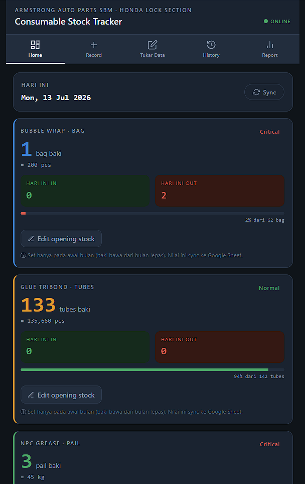
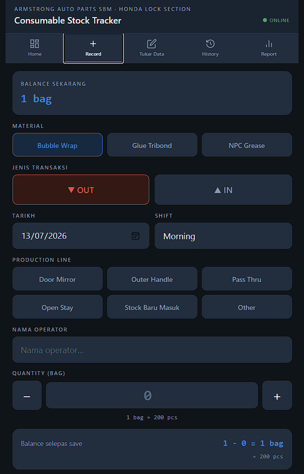
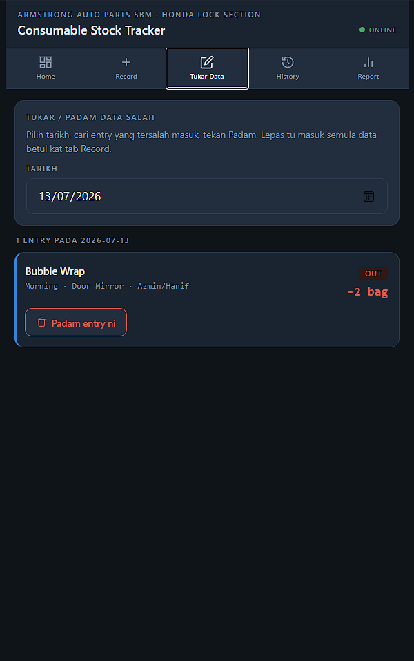
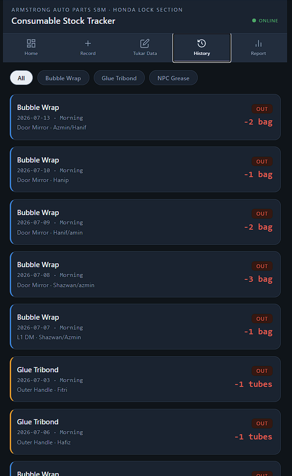

<div align="center">

# 📦 AAP Consumable Stock Tracker

**Sistem penjejakan stok bahan guna habis untuk lantai pengeluaran**

Armstrong Auto Parts Sdn. Bhd. (Seremban) · Honda Lock Section · DM Line

[](https://zulfikriyacob-web.github.io/aap-stock-tracker/)
[]()
[]()
[]()

</div>

---

## 📖 Latar Belakang

Sistem ini dibina selepas satu insiden sebenar di lantai pengeluaran: **stok Bubble Wrap habis tanpa disedari** kerana pemantauan dibuat secara manual di atas kertas. Line terpaksa berhenti menunggu stok baru.

Tracker ini menggantikan proses kertas dengan aplikasi web mudah alih — operator imbas QR, rekod pengeluaran stok dalam masa < 15 saat, dan data terus disegerakkan ke Google Sheets untuk pemantauan dan ramalan.

**Prinsip reka bentuk:**

| Prinsip | Sebab |
|---------|-------|
| 🚫 **Tanpa login** | Operator guna telefon sendiri, tiada akaun syarikat |
| 📱 **Mobile-first** | Digunakan sambil berdiri di lantai pengeluaran |
| ⚡ **Zero infrastruktur** | Tiada server, tiada kos bulanan |
| 🔔 **Alert proaktif** | Sistem cari pengguna, bukan pengguna cari sistem |

---

## ✨ Ciri-ciri

### Untuk Operator
- **Rekod pantas** — pilih material, OUT/IN, kuantiti → simpan
- **Papar penukaran unit** automatik (1 bag = 200 pcs)
- **Baki semasa** dipaparkan sebelum & selepas rekod
- **Tukar Data** — padam entry yang tersilap

### Untuk Jurutera / Penyelia
- **Dashboard** baki, penggunaan harian, status stok
- **Tab Plan** — plan produksi, unjuran baki, jadual delivery
- **Reorder Point** automatik `= Guna/Hari × (Lead Time + Safety Stock)`
- **Alert 4 lapisan** — banner, badge, warna jadual, **email automatik**
- **Report** mingguan/harian + eksport CSV

---

## 📸 Paparan Aplikasi

<table>
<tr>
<td width="50%">
<b>🏠 Home</b><br>
<sub>Kad baki setiap material · penukaran unit · IN/OUT hari ini</sub><br><br>

</td>
<td width="50%">
<b>➕ Record</b><br>
<sub>Rekod OUT/IN · baki dipapar sebelum &amp; selepas simpan</sub><br><br>

</td>
</tr>
<tr>
<td width="50%">
<b>✏️ Tukar Data</b><br>
<sub>Cari entry tersilap ikut tarikh · padam</sub><br><br>

</td>
<td width="50%">
<b>🕐 History</b><br>
<sub>Senarai transaksi · tapis ikut material</sub><br><br>

</td>
</tr>
</table>

---

## 🧭 Tab Aplikasi

| Tab | Fungsi |
|-----|--------|
| 🏠 **Home** | Kad baki setiap material, IN/OUT hari ini, set opening stock |
| ➕ **Record** | Rekod transaksi OUT / IN |
| ✏️ **Tukar Data** | Padam entry tersilap |
| 🚚 **Plan** | Plan produksi · unjuran baki · jadual delivery · setting |
| 🕐 **History** | Senarai transaksi mengikut material |
| 📊 **Report** | Ringkasan mingguan & harian, eksport CSV |

---

## 🏗️ Seni Bina

```
┌──────────────┐   scan QR    ┌────────────────────┐
│   Operator   │ ───────────► │   index.html       │
│  (telefon)   │              │   GitHub Pages     │
└──────────────┘              └─────────┬──────────┘
                                        │ fetch (JSON)
                                        ▼
                              ┌────────────────────┐
                              │  Google Apps Script│
                              │  doGet / doPost    │
                              └─────────┬──────────┘
                                        │
                                        ▼
                              ┌────────────────────┐
                              │   Google Sheets    │
                              │  Records · Plan    │
                              │  Delivery · Config │
                              └─────────┬──────────┘
                                        │ trigger harian
                                        ▼
                                📧 Email Alert
```

**Teknologi:** Vanilla JS (tiada framework, tiada build step) · Google Apps Script · Google Sheets · GitHub Pages

---

## 🚀 Setup

Panduan penuh: **[docs/SETUP.md](docs/SETUP.md)**

Ringkasan:

1. **Google Sheet** — cipta sheet baru, buka `Extensions → Apps Script`
2. **Backend** — paste [`Code.gs`](Code.gs) → Save → Deploy sebagai Web App (`Anyone` access)
3. **Frontend** — salin URL `/exec`, letak dalam `API_URL` di `index.html`
4. **Hosting** — commit `index.html` → aktifkan GitHub Pages
5. **Alert** — set trigger harian untuk `dailyStockAlert` ([docs/DEPLOYMENT.md](docs/DEPLOYMENT.md))

> ⚠️ **Penting:** selepas *setiap* perubahan `Code.gs`, mesti buat **New Version** dalam Manage Deployments. Save sahaja tidak mencukupi.

---

## 🗄️ Skema Google Sheets

Semua tab dicipta **automatik** oleh Apps Script.

<details>
<summary><b>Records</b> — transaksi stok</summary>

| Col | Medan | Nota |
|-----|-------|------|
| A | ID | Unik |
| B | Timestamp | Auto |
| C | Material | Bubble Wrap · Glue Tribond · NPC Grease |
| D | Type | `OUT` · `IN` · `OPENING` |
| E | Qty | Dalam unit material |
| F | Unit | bag · tubes · pail |
| G | Line | Door Mirror · Outer Handle · … |
| H | Shift | Morning · Afternoon · Night |
| I | Operator | Nama |
| J | Date | `yyyy-mm-dd` |
| K | Remarks | |
| L | Balance | **Auto-kira** oleh Apps Script |

</details>

<details>
<summary><b>Plan</b> · <b>Delivery</b> · <b>Config</b></summary>

**Plan** — `Date` · `Material` · `PlanPcs`
**Delivery** — `ID` · `Material` · `Date` · `Qty` · `Unit` · `Status` · `Remarks`
**Config** — `Material` · `SafetyStock` · `ShipmentSize` · `LeadTime` · `AlertEmail`

</details>

---

## 🧮 Model Pengiraan

### Anchor Model (Opening Stock)

Stock check fizikal menjadi **titik kebenaran baru**. Transaksi sebelum tarikh OPENING diabaikan.

```
Baki = OPENING terkini + Σ(IN) − Σ(OUT)   [dari tarikh OPENING]
```

| Tarikh | Transaksi | Baki |
|--------|-----------|------|
| 5 Jun | OUT 10 | *diabaikan* |
| 20 Jun | **OPENING 50** (stock check) | 50 |
| 25 Jun | OUT 8 | **42** |

### Reorder Point

```
ROP = Guna/Hari × (Lead Time + Safety Stock)
```

Selaras dengan amalan industri — safety stock 30–50% daripada penggunaan sepanjang lead time.

| Material | Guna/hari | Penukaran |
|----------|-----------|-----------|
| Bubble Wrap | 700 pcs = 3.5 bag | 1 bag = 200 pcs |
| Glue Tribond | 1,100 pcs = 1.08 tube | 1 tube = 1,020 pcs |
| NPC Grease | 0.5 kg = 0.033 pail | 1 pail = 15 kg |

---

## 🔔 Sistem Alert

| Lapisan | Bila nampak |
|---------|-------------|
| Banner merah (tab Plan) | Buka app |
| Titik merah pada tab | Buka app |
| Baris berwarna (forecast) | Buka app |
| **📧 Email automatik** | **Tanpa buka app** |

Email alert dihantar oleh trigger harian Apps Script apabila baki ≤ safety stock — ini yang menutup jurang sebenar: *tiada siapa perlu ingat untuk menyemak.*

---

## 🔒 Nota Keselamatan

Aplikasi ini **sengaja tanpa autentikasi** kerana operator tiada akaun syarikat. Implikasinya:

- URL Apps Script `/exec` boleh diakses sesiapa yang ada pautan
- Sesuai untuk data operasi dalaman yang tidak sensitif
- **Jangan** simpan maklumat sulit dalam sheet ini

Untuk persekitaran yang memerlukan kawalan akses, lihat nota migrasi M365 dalam [docs/SETUP.md](docs/SETUP.md).

---

## 📁 Struktur Repo

```
aap-stock-tracker/
├── index.html              # Aplikasi (single-file, tiada build)
├── Code.gs                 # Backend Apps Script
├── docs/
│   ├── SETUP.md            # Panduan pemasangan penuh
│   ├── DEPLOYMENT.md       # Cara re-deploy & trigger email
│   └── CHANGELOG.md        # Sejarah versi
├── LICENSE
└── README.md
```

---

## 📜 Sejarah Versi

| Versi | Perubahan |
|-------|-----------|
| **5.1** | Fix balance negatif dalam Report · dokumentasi penuh |
| 5.0 | Tab Plan · forecast · jadual delivery · email alert |
| 4.0 | Fix pengiraan tarikh bercampur · `fixBalances()` |
| 3.0 | Column Balance auto · OPENING disegerak ke Sheet |
| 2.0 | Tab Tukar Data · penukaran unit |
| 1.0 | Rekod asas · sync Google Sheets |

Butiran penuh: [docs/CHANGELOG.md](docs/CHANGELOG.md)

---

## 👤 Penyelenggara

**Zulfikri Yacob** — Senior Manufacturing Quality Engineer
Armstrong Auto Parts Sdn. Bhd. · Honda Lock Section · DM Line

---

<div align="center">
<sub>Dibina untuk menyelesaikan masalah sebenar di lantai pengeluaran.</sub>
</div>
